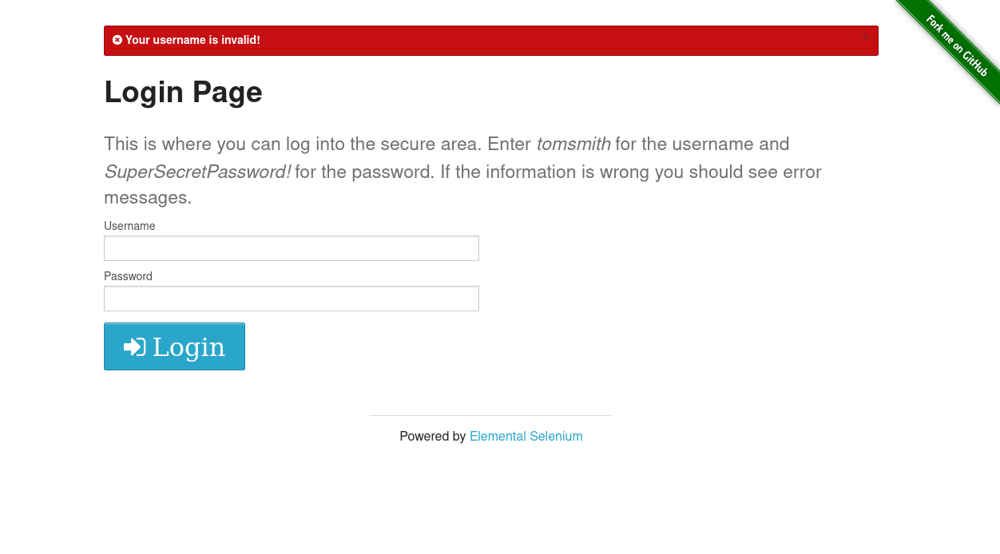

# Web Login Test Automation - Selenium ile Otomasyon Testi

Bu proje, Python ve Selenium kullanarak web tabanlı bir login sayfası üzerinde otomatikleştirilmiş test senaryosu çalıştırmayı amaçlar. Test senaryosu, geçersiz kullanıcı bilgileri ile giriş yapıldığında sistemin uygun bir hata mesajı verip vermediğini kontrol eder.

---

## Test Senaryosu

1. Firefox tarayıcısı açılır  
2. [https://the-internet.herokuapp.com/login](https://the-internet.herokuapp.com/login) sayfasına gidilir  
3. Yanlış kullanıcı adı ve şifre girilir (`wronguser` / `wrongpass`)  
4. Giriş butonuna tıklanır  
5. “Your username is invalid!” mesajının görünmesi beklenir  
6. Mesaj terminale yazdırılır ve tarayıcı kapanır  

---

## Kullanılan Teknolojiler

- Python 3.10  
- Selenium WebDriver 4.x  
- Firefox + Geckodriver  
- Webdriver Manager (otomatik driver yönetimi için)

---

## Kurulum - Gerekli Paketleri Yükleme

```bash
pip install selenium webdriver-manager
```

---

## Testi Çalıştırma

```bash
python3 test_login_invalid.py
```

Kod çalıştıktan sonra terminalde şu şekilde bir çıktı görülür:

```
Hata mesajı: Your username is invalid!
```

---

## Proje Dizin Yapısı

```
proje-klasoru/
├── test_login_invalid.py
├── README.md
└── test-sonucu.png
```

---

## 🖼 Test Sonucu

Aşağıda test sonucunda alınan ekran görüntüsü yer almaktadır:



---
